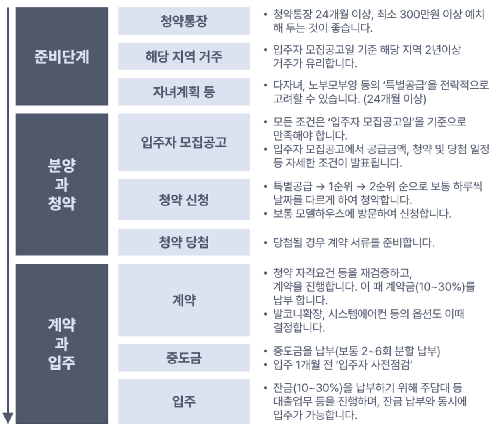
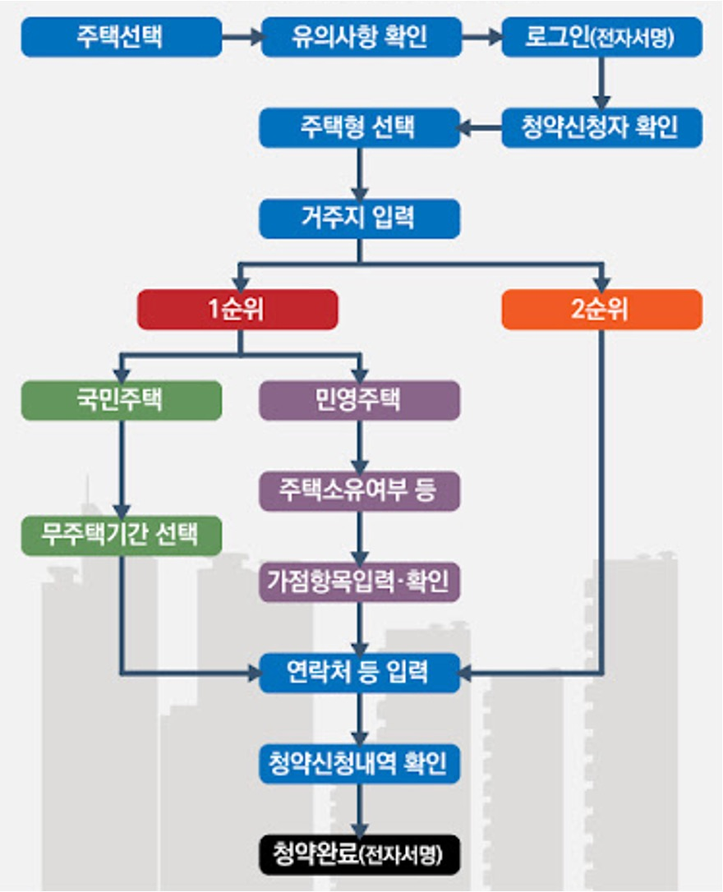
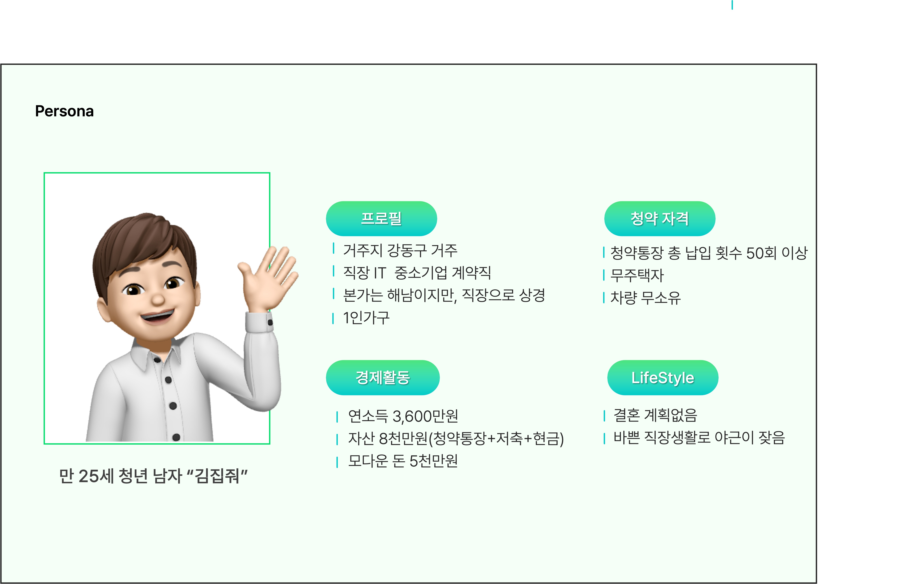
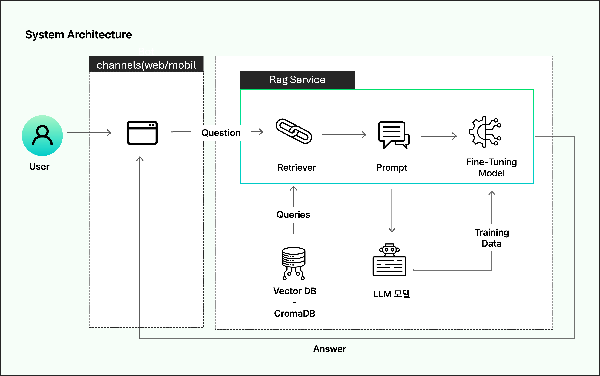
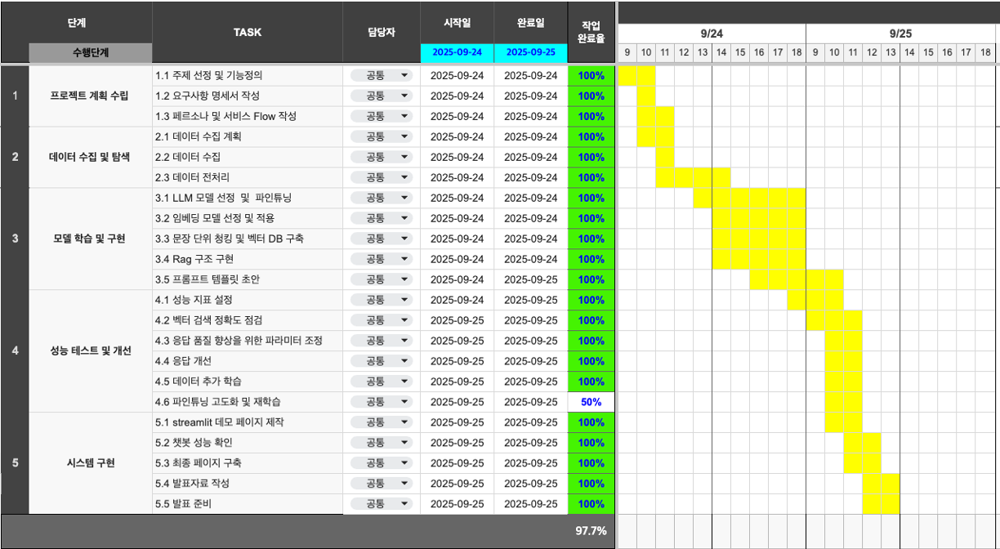
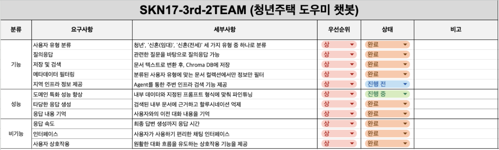
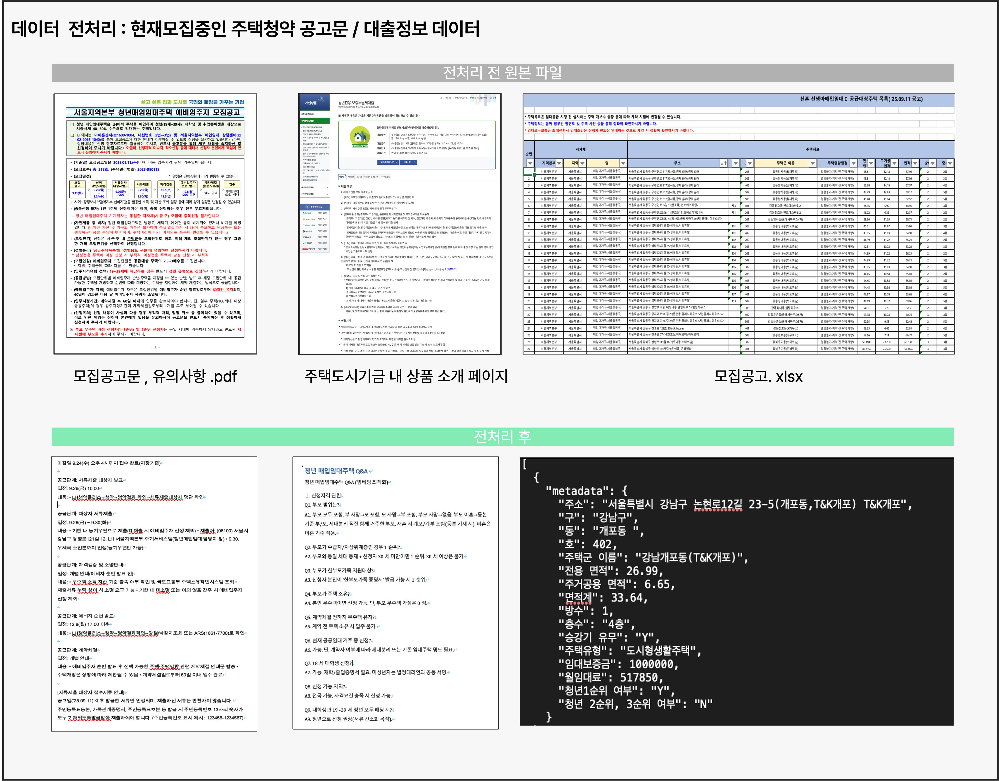
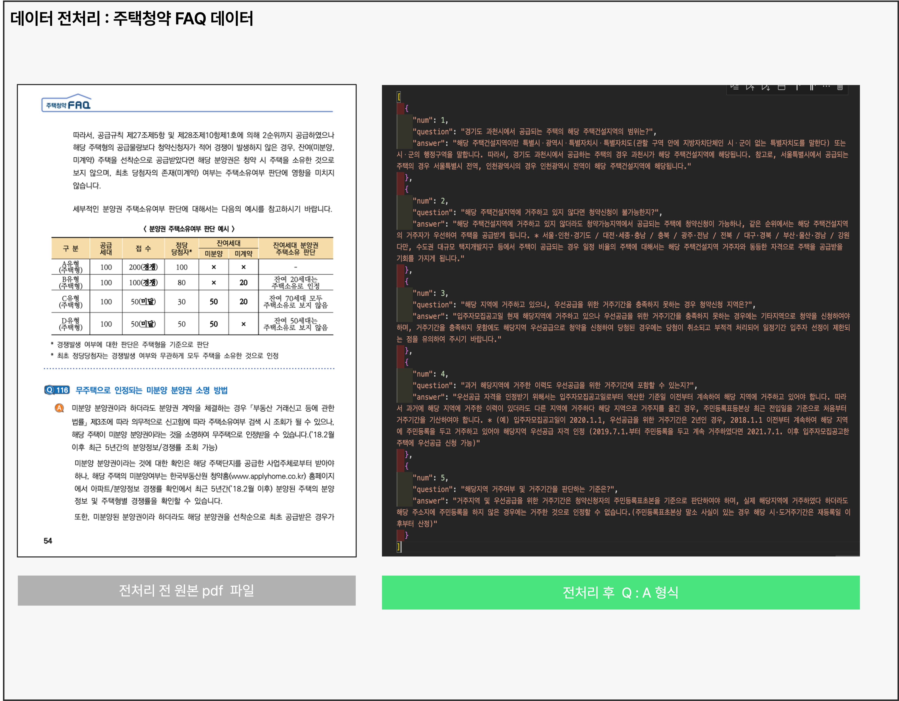

# SKN17-3rd-2Team
------
# 1️⃣ 팀 소개 

## 팀명 : ROOM MATE 🏠
사용자의 가장 가까운 주거 파트너가 되어 안정적인 시작을 도와주는 의미를 담았습니다.

## 팀원 소개 
| 김주서 | 김태완 | 성기혁 | 양송이 | 임산별 |
|:---:|:---:|:---:|:---:|:---:|
|  |  |  |  |  |
| [@kimjuseo71](https://github.com/kimjuseo71) | [@Kicangel](https://github.com/Kicangel) | [@venus241004](https://github.com/venus241004) | [@songeeeey](https://github.com/songeeeey) | [@ImMountainStar](https://github.com/ImMountainStar) |
<br>

# 2️⃣ 프로젝트 개요 
## ✔️ 프로젝트 명 | 청년과 신혼부부를 위한 주택청약 도우미 챗봇

<br>

## ✔️ 프로젝트 소개 
- 사용자가 **복잡한 청약 절차**를 손쉽게 이해하고, 본인 조건에 맞는 물량과 주거지원까지 바로 확인할 수 있는 **통합형 챗봇 서비스**입니다.
- RAG를 활용하여 벡터DB와 한국어 특화 LLM을 연동함으로써 정책 문서·FAQ·공고문에서 근거를 검색하고 **정확하고 신뢰도 높은 맞춤형 답변**을 제공합니다.

## ✔️ 프로젝트 필요성 
### (1) 프로젝트 배경 : 상황분석
🏠 주택청약의 공급과 수요 증가 
> **청약통장 가입자, 2년 9개월 만에 증가…·청약 혜택 확대 통했나**  
> 3월 가입자 전월 대비 4435명 증가…
> 3기 신도시 기대감  
> 정부, 청년·신혼부부 청약 혜택 확대  
>  
> *박영규 기자, [이코노믹리뷰](https://www.econovill.com/news/articleView.html?idxno=693037), 2025.04.22 23:14*
>
<br>

😰 주택청약 제도의 복잡함으로 인한 **사용자의 불편함** 존재 
- 잦은 제도 개편과 복잡한 공급방식 및 자격 요건으로 **복잡도** 증가
- 다양한 공급방식과 공급처로 인해 정보가 **산발적**으로 존재함
=> 사용자의 주택청약 신청과정이 복잡함
<br>

| [청약 절차 과정](https://hkpm.co.kr/%EC%95%84%ED%8C%8C%ED%8A%B8-%EC%9D%BC%EB%B0%98-%EB%B6%84%EC%96%91-%EC%B2%AD%EC%95%BD-%EC%A0%88%EC%B0%A8-%EC%88%9C%EC%84%9C-2024/) | [청약 신청 및 가점 계산](https://news.bizwatch.co.kr/article/real_estate/2019/09/06/0001) |
|---|---|
|  |  |

### (2) 문제 정의
1. **정보 접근성의 한계**  
   - 청약 관련 정보가 국토교통부, SH/LH, 지자체 등 여러 사이트에 흩어져 있어, 사용자가 원하는 정보를 한 번에 얻기 어려움  

2. **청약 프로세스의 복잡성**  
   - 청약 과정은 단순 신청이 아닌 **자격 확인 → 청약 신청 → 당첨 확인 → 대출 및 입주 절차** 등 다단계 구조로 이루어짐  
   - 공급 방식(공공분양, 민영주택 등), 자격 요건, 당첨 기준이 복잡하며 제도 개편도 잦아 일반 사용자가 이해·적용하기 어려움  

3. **맞춤형 지원 부족**  
   - 연령, 소득, 무주택 기간 등 개인 조건에 따라 가능한 공고와 대출 상품이 달라지지만, 이를 **한눈에 확인할 수 있는 서비스 부재**
   - 결과적으로 사용자는 각 단계를 개별적으로 탐색·확인해야 하며, 이는 **시간·비용 측면에서 큰 불편**을 초래
<br>

## ✔️ 프로젝트 목적 
- 주택청약 공식 문서 데이터 기반의 대화를 통해 정확하고 신뢰도 높은 정보 제공
- 사용자와의 대화 메모리를 통해 개인 조건에 적합한 공고 및 청약 매물 , 주거 지원 정책 추천
- 사용자 맞춤형 공고 추천, 매물, 주거지원정책, 주택청약 기본정보 단계를 통합적으로 지원

<br>

### 👤 사용자 페르소나 

**주택청약 청년 대상 페르소나 & 사용자 분석**



#### 🔍 사용자 분석 
- **Needs**: 강동구에서 대출 기반으로 보증금 1억 이하 안정적 주거 마련 원함
- **Pain Points**: 복잡한 청약 제도와 정보 분산으로 본인 조건 확인이 어려움
- **Expected Value**: 내 상황에 맞는 청약 자격과 공고를 빠르게 추천받고 시간 절약

# 3️⃣ 기술스택 및 사용한 모델 
## ✔️ 기술스택
| 카테고리 | 기술 스택 |
|----------|-----------|
| **사용 언어** |  |
| **임베딩 모델** |  |
| **벡터 DB** |  |
| **LLM** |  |
| **프레임워크** |  |
| **인터페이스(UI)** |  |
| **관리 및 협업** |     |

<br>

## ✔️ LLM 모델 및 선정 이유 
### LLM 모델 : ```heegyu/EEVE-Korean-Instruct-10.8B-v1.0-Q5_K_M.gguf```

### 모델 선택 이유
**(1) 한국어 특화 성능**
- 야놀자자가 개발한 **한국어 처리에 최적화된 모델**로써, 한국어 질의 및 응답에 강하다
    
<br>

**(2) 한국어 벤치·커뮤니티 성과**
- EEVE 계열은 한국어 LLM 벤치에서 상위권으로 언급되어 왔고, 실사용 커뮤니티에서 다양한 응용 모델도 존재해 현업 적용 레퍼런스가 있다. 

---

# 4️⃣ 시스템 아키텍쳐


<br>

# 5️⃣ WBS 

<br>
<br>

# 6️⃣ 요구사항명세서 

<br>

# 7️⃣ 데이터 소개 및 전처리 보고서 
## 1. 데이터 소개 <br>
## 데이터(1): 주택청약 공고문
- **데이터 출처** : [한국토지주택공사(LH)](https://www.lh.or.kr/main/)  
> *SH는 현재 모집중인 공고가 없으므로 제외함*
- **데이터 수집 방법** : 문서 직접 다운로드

### 데이터 파일 목록
| 구분 | 파일명 | 데이터 형식 |
|------|------------|-------------|
| **청년 매입임대** | 25년 3차_청년 매입임대_모집공고문 |```pdf```|
|  | 25년_3차_청년 매입임대_QnA |```hwp```|
|  | 서울지역본부_청년매입임대_신청시_유의사항 |```pdf```|
|  | 25년_3차_청년매입임대_공급주택목록 |```excel```|
| **신혼/신생아 매입임대Ⅰ** | 25년 3차_신혼/신생아1 매입임대_모집공고문 |```pdf```|
|  | 25년_3차_신혼/신생아1 매입임대_QnA |```hwp```|
|  | 서울지역본부_신혼/신생아1 매입임대_신청시_유의사항 |```pdf```|
|  | 25년_3차_신혼/신생아1 매입임대_공급주택목록 |```excel```|
| **신혼/신생아 매입임대Ⅱ (전세형)** | 25년 3차_신혼/신생아2 매입임대_모집공고문 |```pdf```|
|  | 25년_3차_신혼/신생아2 매입임대_QnA |```hwp```|
|  | 서울지역본부_신혼/신생아2 매입임대_신청시_유의사항 |```pdf```|
|  | 25년_3차_신혼/신생아2 매입임대_공급주택목록 |```excel```|

### 데이터 전처리 방식
1. 모집 공고문, QnA , 신청시 유의사항 파일
   - pdf 파일 텍스트 변환
   - 불필요한 별첨 파일 제거
   - 테이블 표 -> 텍스트 형태 변환
   - 특수기호 제거
2. 공급주택 목록 파일
   - 필요없는 칼럼(지자체, 주택열람일정) 제거
   - 각 칼럼을 메타데이터로 하는 json 형식변환

## 데이터(2): 대출정보 데이터
- **데이터 출처** : 주택도시기금  
- **데이터 설명** : [주택도시기금 사이트](https://nhuf.molit.go.kr/)  
- **데이터 수집 방식** : 사이트 내 정보 문서화

### 데이터 파일 목록
| 데이터명 | 데이터 형식 |
| -------------- | --- |
| 1. 청년전용_보증부월세대출 |```docx```|
| 2. 청년전용_버팀목전세자금 | ```docx``` |
| 3. 신생아_특례_버팀목대출| ```docx``` |
| 4. 주거취약계층_이주지원_버팀목전세자금 | ```docx``` |
| 5. 전세피해_임차인_버팀목전세자금 | ```docx``` |
| 6. 전세피해임차인대상_버팀목전세대출대환| ```docx``` |
| 7. 전세사기피해자_최우선변제금버팀목_전세자금_대출 | ```docx``` |
| 8. 주거안정월세대출| ```docx``` |
| 9. 신혼부부전용_전세자금 | ```docx``` |
| 10. 버팀목전세자금| ```docx``` |
| 11. 갱신만료_임차인_지원_버팀목전세자금 | ```docx``` |
| 12. 전세금안심대출보증 | ```docx``` |

### 데이터 전처리 방식
   - pdf 파일 텍스트 변환
   - 불필요한 별첨 파일 제거
   - 테이블 표 -> 텍스트 형태 변환

## 데이터(3): 주택청약 FAQ
### 데이터 전처리 방식
   - 불필요한 별첨 파일 제거
   - 테이블 표 -> 텍스트 형태 변환
   - `{ “Num” : ”...”, "Quetsion" : “...”, “Answer” : ”...” }` json 형태로 변환

<br>

## 2. 데이터 전처리 결과 <br>

<br>

<br>


# 8️⃣ DB 연동 구현 코드
📂[벡터 DB](https://github.com/SKNETWORKS-FAMILY-AICAMP/SKN17-3rd-2Team/blob/main/Embedding)

## 💬 DB 구현 요약
- `OpenAI Embedding` 모델 사용
- `Chorma DB`에 저장하여 RAG 시스템에 연결
- 파일 형식 별 데이터 변환 및 Chunking
1. `.docx`, `.pdf`
- SementicChunker를 이용해 문맥 단위로 분할 후, RecursiveSplitter를 이용해 문단 및 줄 바꿈 기준으로 분할

2. `.xlsx`
- 테이블 형식의 데이터를 JSON 형식으로 변환 후, 각 행을 기준으로 분할

# 9️⃣ 테스트 계획서 및 결과서 
## 1. 테스트 계획서

### 1.1 테스트 개요
- **테스트 일자** : 2025년 9월 25일  
- **테스트 모델** : `./EEVE-Korean-Instruct-10.8B-v1.0-Q5_K_M`  
- **목적** : 청년/신혼 주택·대출 챗봇의 응답 품질을 평가하고, 결함 발생 시 후속조치를 체계적으로 마련

### 1.2 테스트 항목

#### (1) 정성적 평가지표

| 항목 | 중요도 | 설명 |
|------|---------|------|
| 사용자의 조건 맞춤 | 매우 높음 | 입력된 사용자의 조건을 기억해, 적절한 응답을 제공 |
| 응답(출력)의 일관성 | 보통 | 사용자의 신뢰성을 위해 동일/유사 질문에 대해 일관된 구조와 형식을 출력해야 함 |

#### (2) 정량적 평가지표  
성능지표 : [LangChain Evaluate a RAG Application](https://docs.langchain.com/langsmith/evaluate-rag-tutorial#heres-a-consolidated-script-with-all-the-above-code)

| 항목 | 중요도 | 선택 사유 |
|------|---------|-----------|
| 응답 속도 | 보통 | UX에 직접 영향을 끼침 |
| Answer Relevance (답변 관련성) | 높음 | 모집공고, 모집 주택 리스트, 대출정보, FAQ 등 복잡한 정보가 섞여 있어 사용자의 질문 의도에 맞는 정확한 응답이 필요 |
| Answer Correctness (답변 정확성) | 매우 높음 | 정책·지원절차 내용은 행정적 절차와 연결되므로, 오류 발생 시 사용자에게 큰 피해가 발생. 사실적 정확성을 제공해야 함 |
| Groundedness | 높음 | 할루시네이션 방지 및 세부 수치(소득, 금리, 보증금 등)를 실제 공식 자료에 근거해 정확히 제공해야 함 |

## 2. 테스트 결과서

### 2.1 테스트 결과 표

| **질문번호** | **사용자 조건 맞춤형 답변** | **응답의 일관성** | **응답속도** | **Answer Relevance** | **Answer Correctness** | **Groundedness** | **종합결과** | **결함 여부** | **결함 사유** |
|--------------|------------------------------|-------------------|--------------|-----------------------|------------------------|------------------|--------------|---------------|----------------|
| Q1 | 1 | 0.6 | 0 | 1 | 1 | 1 | 0.81 | Low | 응답 출력 형식이 일관적이지 않고, 응답 속도가 오래 걸림 |
| Q2 | 1 | 0.4 | 0 | 1 | 1 | 1 | 0.79 | Low | 응답 내용은 정확하나, 1차와 2차 응답 다른 내용이 추가됨. 응답 형식이 일관적이지 않음 |
| Q3 | 1 | 0.2 | 0 | 1 | 1 | 1 | 0.77 | Medium | 질문 맥락과 맞지 않는 다른 내용이 나옴 |
| Q4 | 1 | 0.6 | 0 | 1 | 1 | 1 | 0.81 | Low | 응답 내용은 정확하나, 출력 형식이 일관적이지 않음 |
| Q5 | 1 | 0.6 | 0 | 1 | 1 | 1 | 0.81 | Low | 응답 내용은 정확하나, 1차·2차 응답에 다른 요소가 추가됨. 출력 형식이 일관적이지 않음 |
| Q6 | 1 | 1 | 0 | 1 | 1 | 1 | 0.85 | Low | 응답 내용은 정확하나, 출력 형식이 일관적이나 응답 시간이 오래 걸림 |
<br>

### 2.2 종합 평가

모델은 **Answer Relevance, Correctness, Groundedness** 항목에서 모두 True를 기록하여 응답의 정확성과 근거 기반 성능이 우수하게 나타났다.  
그러나 동일한 맥락의 질문임에도 시도에 따라 응답 형식이 달라지거나 불필요한 부가 요소가 추가되는 문제가 확인되었다.  
또한 평균 응답 시간이 약 3분 이상으로 다소 지연되는 점이 관찰되었다.  

- **강점**: 응답의 사실적 정확성이 높고, 근거 문서를 기반으로 한 신뢰도 높은 답변 제공  
- **약점/개선점**: 응답 형식의 일관성 부족, 불필요한 정보 출력, 과도한 응답 지연 문제 개선 필요  

<br>

# 🔟 진행 과정 중 프로그램 개선 노력
## 개선 전 문제점
- Chunk내의 문맥이 유지 되지 않고, Chunk size가 적절하지 않아 응답의 질이 저하<br>
  <details>
  <summary> <b>해결 방법:</b> Chunking</summary> 
  RecursiveSplitter를 사용하면 chunk 안의 내용의 문맥이 이어지지 않는 경우가 많음 <br>
  먼저 SemanticChunker를 이용해 chunk 안의 내용의 문맥을 유지하게 만든 후, chunk size가 크다면 RecursiveSplitter를 이용해 chunk size를 줄이는 작업을 진행
</details>

- Vector DB 내에 유사한 문서들이 많이 존재해 원하는 문서를 가져오지 못함 <br>
  <details>
  <summary> <b>해결 방법:</b> 벡터 DB Collection 활용</summary>
  내용이 비슷한 문서 데이터 (신혼/신생아1 매입임대_모집공고문, 신혼/신생아2 매입임대_모집공고문)를 한 Collection 안에 저장할 경우, 잘못된 데이터를 가져오는 경우가 발생<br>
  또한 공실 데이터 문서 내에 단순 주소 데이터만 존재하기 때문에, 각 문서들을 특정할 수 없어 잘못된 데이터를 가져오는 경우가 발생 <br>
  따라서, 같은 자격 유형에 따라 Collection으로 분리한뒤 해당하는 문서 데이터들을 저장함으로서, 환각 현상 및 잘못된 데이터 로드 현상을 해결함 <br>
</details>

- 핵심 키워드(예: 주소 정보; '강동구')를 감지 하지 못해 Hallucination이 발생 <br>
  <details>
  <summary> <b>해결 방법:</b> Metadata를 이용한 필터링</summary>
  사용자가 선호 지역에 대한 질의를 할 경우 (예:강동구에 있는 공실 주택 정보를 알려줘), '강동구'라는 핵심 키워드를 이용해 알맞은 데이터를 로드해야하는데, retriever가 이를 원만히 수행하지 못함 <br>
  따라서, metadata를 활용해 벡터 DB를 필터링하여, 직접 '강동구' 주택 정보를 가져올 수 있게 만듦
</details>

- Chat history가 계속 쌓여 나감에 따라, 프롬프트 길이가 증가해 응답 속도 저하 및 토큰 비용 증가 <br>
  <details>
  <summary> <b>해결 방법:</b> Chat History 길이 제한</summary>
  필요성 : Context Window는 유한하기 때문에, 최근 6 턴만 대화내용 유지 <br>
  Hallucination 발생 가능성 증가 : 오래된 맥락이 남아 있으면, 모델이 불필요한 정보까지 섞어 답할 확률이 높아짐 <br>
  비용 및 속도 감소 : 프롬프트의 길이가 줄어 추론 시간이 단축 및 토큰 비용 절약 <br>
</details>

- '그 집 정보 좀 줘'와 같은 짧고 모호한 질문을 이해하지 못함 <br>
  <details>
  <summary> <b>해결 방법:</b> 독립질문 설정</summary>
  대화 맥락에 의존하던 마지막 사용자 질문을, <b>문맥 없이도 이해 가능한 한 문장으로 재작성한 질문</b><br>
  그 집의 보증금은? 같은 질문은 맥락 없이 모호하기 때문에, 독립 질문으로 변환<br>
  <b>예시</b> <br>
  원문 : '그 집 보증금 정보를 알려줘?'<br>
  히스토리 요약 : 앞서 강서구 주소 정보 얘기중<br>
  독립 질문 : '강서구 아파트 보증금 정보를 알려줘'<br>
  효과 : 짧고 모호한 질문에 대해 응답의 질이 좋아진다 
</details>
<br>

# ⭐ 기대 효과
- 개인화된 상호작용 : 사용자의 나이, 소득, 자산, 청약 통장 등 맥락 정보를 반영하여 맞춤형 주택 정보, 정책 및 대출 상품을 제공 → 불필요한 정보 탐색 시간 절감
- 접근성 및 신정확성 확대 : 흩어진 공식 공고문, 정책 자료, FAQ 등 복잡한 정보를 통합해 간단한 인터페이스로 제공 → 주거 지원 정보 접근성 강화
- 시간 및 비용 절감 : 공고 확인, 자격 검증, 가점 계산, 대출 가능 여부 파악 등 복잡한 절차를 챗봇이 자동화 → 사용자 입장에서 절차 소요 시간 단축 및 정보 탐색 비용 감소

<br>

# 🛠️ 향후 개선점
1. 응답 속도 최적화 : 평균 3분 이상 걸리는 응답 지연 문제를 해결하기 위해 프롬프트 경량화, 모델 최적화 기법 적용
2. 응답 형식 일관성 강화 : 동일/유사 질문에 대해 구조와 톤이 일관되도록 출력 템플릿 설계
3. 데이터 소스 확대 : 현재 주택 청약·대출 중심의 데이터에서 다양한 정책·지원 제도까지 통합하여 정보 범위 확장
4. 개인화 고도화 : 소득 계산, 월세-보증금 전환 계산 등 사용자 맞춤형 계산 기능을 제공하여 더욱 정밀한 개인화 서비스 구현

<br>

# 12. 수행결과 (테스트/시연 페이지)


## 🌈 팀원 한 줄 회고
<table>
  <tr>
    <th style="width:80px;">이름</th>
    <th>회고 내용</th>
  </tr>
  <tr>
    <td>김태완</td>
    <td>LLM 모델 설계에 필요한 전 단계들을 경험하면서 이론적으로 배웠던 것들을 직접 활용할 수 있었던 좋은 경험이였습니다</td>
  </tr>
  <tr>
    <td>성기혁</td>
    <td>파인튜닝과 크로마 DB구축 프롬프트 엔지니어링까지 직접 구현해보는 경험이었다. 비록 성능이 안나와서 다른 모델을 사용해야 했지만 성장에 큰 도움이 되었다</td>
  </tr>
  <tr>
    <td>임산별</td>
    <td>LLM 모델에 최적화된 데이터 전처리부터 성능 향상을 위한 다양한 실험까지 진행하며, 기획 단계에서부터 실제 구현까지 전 과정을 직접 수행할 수 있었습니다.</td>
  </tr>
  <tr>
    <td>양송이</td>
    <td>LLM 설계 과정에서 메모리 오류나 CUDA 오류 등 많은 문제들이 있었지만, 하나하나 해결하면서 초기 환경 구축의 중요성을 느꼈습니다. 데이터의 크기가 큰 만큼 전처리가 중요했고, 그 과정에서 모델의 구조 뿐만 아니라 실제 구동 과정에서의 안정성도 중요하다는 것을 깨달았습니다</td>
  </tr>
  <tr>
    <td>김주서</td>
    <td>데이터를 모으는 것보다 서로 다른 형태를 하나로 합치는 과정이 더 어려웠습니다. 그 과정을 보며 단순한 전처리 기술 적용이 아니라, 학습에 맞게 데이터를 나누고 설계하는 고민이 필요하다는 걸 느꼈습니다.</td>
  </tr>
</table>
